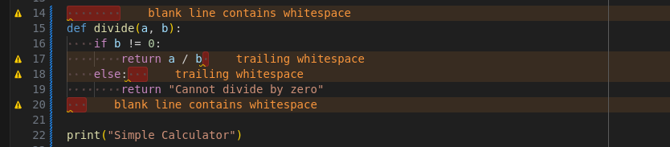
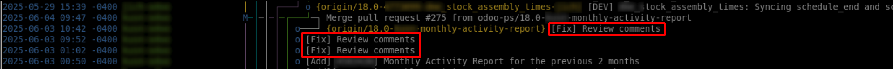
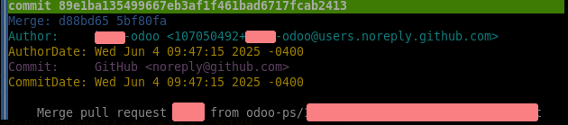
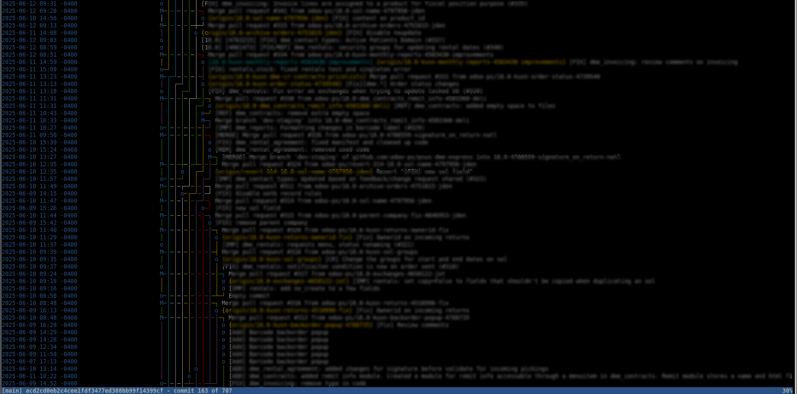
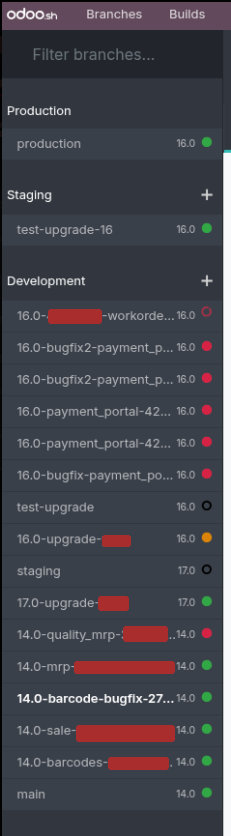
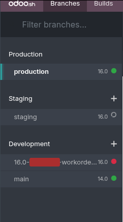

# Code Style Guide


_This document is following the official [Coding Guidelines] which you should
read first._

It contains a list of the most **recurring mistakes**, implicit **conventions**
and non-written **best practices** related to Odoo coding.\
It also repeat some points mentioned in the official [Coding Guidelines] to add
some explanation, example or emphasis on the importance to follow it.

Those are important, because they make the code easier to read, easier to debug,
faster to review, reduce the risk of bugs and just help ensuring consistency
between Odoo repositories.

**Basic example:**
If you want to know where is declared the "Cup" relational field of the
"Kitchen" model, you should **always** find it in a blink, without even having
to search for it:
- Exactly in the `/models/kitchen.py` file
- Named exactly `cup_id`

The "Kitchen" views (form, list, ..) should be defined exactly in
`/views/kitchen_views.xml` (not in `/views/kitchen_templates.xml`, this is for
portal/website QWeb views).

> [!IMPORTANT]
> 👉 **Strict code convention is not a way to be annoying, it's a way to make
> everyone life easier and save time to everyone.**

Remember, once your code is done, it will:
- **always** be read and reviewed, possibly multiple times, possibly by
  multiple people
- **likely** have to be debug and fixed, possibly multiple times
- **always** be read and upgraded, multiple times, by multiple people

> [!TIP]
> This article from David Goodger about [Code Style in Python] is also a very
> good read.

## Table of Contents
* [Technical Details](#technical-details)
   * [Use `filtered()`](#use-filtered)
   * [Avoid `mapped()` on relational fields](#avoid-mapped-on-relational-fields)
   * [`api.depends` decorator](#apidepends-decorator)
      * [No `write()` in computes](#no-write-in-computes)
      * [Use `write()` correctly](#use-write-correctly)
   * [Domain manipulation](#domain-manipulation)
   * [Xpath Tricks](#xpath-tricks)
      * [`$0` magic variable](#0-magic-variable)
      * [`Move` Xpath](#move-xpath)

* [Style](#style)
   * [Trailing commas](#trailing-commas)
   * [Naming and paths](#naming-and-paths)
   * [Manifest dependencies](#manifest-dependencies)
   * [Alphabetical Ordering](#alphabetical-ordering)
   * [Empty recordset loop](#empty-recordset-loop)
   * [Favor `Commands`](#favor-commands)
   * [Comment your patches](#comment-your-patches)
   * [Useless variables](#useless-variables)
   * [Modules splitting](#modules-splitting)
   * [Chars rule](#chars-rule)

* [Linting](#linting)
   * [Python](#python)
   * [Javascript](#javascript)
   * [Trailing whitespaces](#trailing-whitespaces)

* [Commit Message](#commit-message)
   * [Task ID Reference](#task-id-reference)
   * [Commit message matter](#commit-message-matter)
   * [Never use merge commit](#never-use-merge-commit)

* [Misc](#misc)
   * [Odoo.sh dev branches](#odoosh-dev-branches)


## Technical Details

### Use `filtered()`

Don't:
```py
for line in orders.order_line:
    if line.display_type
        continue
    do_some_code()
```
Do:
```py
for line in orders.order_line.filtered(lambda l: not l.display_type):
    do_some_code()
```

### No `filtered()` or `mapped()` in `any()`

It fully nullifies the short-circuit optimization of `any()` as you will first
go through a full loop in `filtered()` before going into a second loop in `any`
that will be ably to short-circuit.

With big recordset and depending of how early or not the short-circuit would
happen, this could be hundreds of time slower.

See benchmark

```py
import timeit

a = self.env['mail.mail'].search([])
a = a.browse(a.ids * 20)

timeit.timeit('any(a.mapped("references"))', globals=globals(), number=1000)
# Takes 1.1654435170057695 second
timeit.timeit('any(m.references for m in a)', globals=globals(), number=1000)
# Takes 0.02652950100309681 second
```

Don't:
```py
order.show_configuration_warning = order.is_rental_order and any(
    order.order_line.filtered(lambda line: line.is_something and not line.xyz)
)
```
Do:
```py
order.show_configuration_warning = order.is_rental_order and any(
    line.is_something and not line.xyz for line in order.order_line
)
```

### Don't use `mapped()` for relational fields

`mapped()` is only useful to read **non-relational** fields on recordset.\
Keep it simple for relational fields.

Don't:
```py
product = orders.order_line.mapped('product_id')
product_ids = orders.order_line.product_id.mapped('ids')
```
Do:
```py
product = orders.order_line.product_id
product_ids = orders.order_line.product_id.ids
```

### `api.depends` decorator

A method decorated with `api.depends` won't be executed anymore unless at least
one of the values of the fields listed in `api.depend()` change.\
It means that if your decorator is missing one field, your method won't properly
by invalidated and will keep using a "wrong" value.

```py
name = fields.Char(compute="_compute_name")

@api.depends('color', 'sleeve_type')
def _compute_name(self):
    for rec in self:
        rec.name = f"[{rec.size}] {rec.color} with {rec.sleeve_type} sleeves shirt"
```
In this case, `name` should be updated if `size` is changed, as the size is part
of the name.\
But `size` has been forgotten in the decorator. It means that even if `size` is
changed, the `name` will still display the previous `size` value used the last
time this method was called.\
The value will be "wrong" until either `color` or `sleeve_type` is changed.

> [!WARNING]
> Please never take shortcut like not listing `field_A` because `field_B` is
> already listed and `field_B` is supposed to trigger a change of value in
> `field_A` according to the business code.\
> Also don't omit a field because you think its value should never change.
>
> Both those cases will create bugs at some point, because business code can and
> will change. So please always list all the fields, explicitly.

> [!WARNING]
> If you are checking user groups in the method, you also need to add the
> decorator `@api.depends_context('uid')` so it's user dependent.

### No `write()` in computes

Never call `write()` inside a field's `compute` method.\
Use the dot notation (`record.field = 'something'`), or `.update({})` if you
have multiple values to set.

Calling `write()` is committing the transaction and storing the change in DB,
while `compute` can be called by `onchange` RPC calls, supposed to return new
values that can later be discarded by the user.\
If one of computed field actually called `write()`, the discard won't be able to
discard that value, leading to inconsistent and unwanted changes in DB, causing
issues.

### Use `write()` correctly

When writing on a single field, do:
```py
# Clear and simple
partner.name = "Robert"
```
Don't:
```py
# Verbose and complicated for no reason
partner.write({'name': "Robert"})
```

When writing on multiple fields, do:
```py
# Single `write()` call
partner.write({
    'name': "Robert",
    'age': 50,
    'size': 170,
})
```
Don't:
```py
# 3 separate `write()` calls instead of 1
partner.name = "Robert"
partner.age = 50
partner.size = 170
```

### Domain manipulation

Never concat domains yourself with list's `append()` or `+`.\
Use the `expression.OR()/AND()` to avoid bugs.

```py
from odoo.osv.expression import AND

def get_domain(self):
    res = super().get_domain()
    new_domain = [('field', '=', 'value')]
    res = OR([res, new_domain])
    return res
```

### `logger()` and `_()` params

Never use fstring or string interpolation directly.\
This one is detailed in the Coding Guidelines [Use Translation method Correctly]
section.

Don't:
```py
_('Record %s cannot be modified!' % record)  # Mind the `%`
```
Do:
```py
_('Record %s cannot be modified!', record)  # Mind the `,`
```

### Access Rights

Don't blindly copy paste the ACL from the Odoo warning log. It will add basic
`1,1,1,1` (granting all rights) accesses to any user.\
Most of the time, you only want `1,0,0,0` for regular users. Only admins or
manager groups should receive `1,1,1,1`.

Generally don't:
```
id,name,model_id:id,group_id:id,perm_read,perm_write,perm_create,perm_unlink
access_model_example_1,model_example_1_user,model_example_1,base.group_user,1,1,1,1
access_model_example_2,model_example_2_user,model_example_2,base.group_user,1,1,1,1
```
Do:
```
id,name,model_id:id,group_id:id,perm_read,perm_write,perm_create,perm_unlink
access_model_example_1,model_example_1_user,model_example_1,account.group_account_manager,1,1,1,1
access_model_example_1,model_example_1_user,model_example_1,base.group_user,1,0,0,0
access_model_example_2,model_example_2_user,model_example_2,account.group_account_manager,1,1,1,1
access_model_example_2,model_example_2_user,model_example_2,base.group_user,1,0,0,0
```

### Limit your search

If you only care about knowing if there is at least one record, or want to only
get the first one, don't forget `limit=1` on your search.

Don't:
```py
existing_record = self.env["my.record"].search([
    ('field_1', '=', record.some.thing.id),
    ('field_2', '=', 'no'),
])
if existing_record:
    raise UserError()
```
Do:
```py
existing_record = self.env["my.record"].search([
    ('field_1', '=', record.some.thing.id),
    ('field_2', '=', 'no'),
], limit=1)  # /!\ See the `limit=1` here
if existing_record:
    raise UserError()
```

### Xpath Tricks

#### `$0` magic variable

When you replace an element, you can actually output the element you just
replaced by using `$0`. This is generally saving you from a lot of copy paste!

```xml
<xpath expr="//div[hasclass('card-body')]/span" position="replace">
    <a t-attf-href="/customers/#{slug(reference)}">$0</a>
</xpath>
```
This example is wrapping a `<span/>` inside a `<a/>`, making it clickable.\
If the original `<span/>` ever receive a fix or an update (could be some class,
attribute, text..), you will benefit from it directly since you didn't copy
pasted the node (which would be sort of "frozen" at the time you copied it).

This can of course be used on a whole DOM section, if for instance you want to
wrap an entire part of a view inside a new node.

<details>

<summary>See a small concrete example</summary>

Given this template:
```xml
<td name="td_quantity" class="o_td_quantity text-end">
    <span t-field="line.product_uom_qty" class="text-nowrap">3</span>
    <span t-field="line.product_uom">units</span>
    <span t-if="line.product_packaging_id">
        (<span t-field="line.product_packaging_qty" t-options='{"widget": "integer"}'/> <span t-field="line.product_packaging_id"/>)
    </span>
</td>
```

If you want to have an empty `<td/>`, instead of:
- adding as many xpaths as there are children to add a `t-if` on each nodes
- repeating the `if` condition on each noce
- having your code broken if any node is removed
- having your code not working if a new node is added (won't receive `t-if`)

You could just do this:
```xml
<xpath expr="//td[@name='td_quantity']" position="replace">
    <t t-if="a_new_custom_condition">
        <t>$0</t>
    </t>
    <t t-else="">
        <td/>
    </t>
</xpath>
```

</details>

#### `Move` Xpath

Xpath `position` attribute comes with a handy `move` value.

Don't:
```xml
<!-- Remove field -->
<xpath expr="//field[@name='barcode']" position="replace"/>
<!-- Add it elsewhere -->
<xpath expr="//field[@name='name']" position="after">
    <field name="barcode"/>
</xpath>
```
Do:
```xml
<!-- Move it where you need -->
<xpath expr="//field[@name='name']" position="after">
    <xpath expr="//field[@name='barcode']" position="move"/>
</xpath>
```


## Style


### Trailing commas

Always add trailing commas on multiline elements:
- Method calls
- Object/Dict
- Array/List
- Fields properties list
- Tuples
- ..

This is done for 2 reasons:
1. It will avoid useless diff "noise" when someone will add something to those
   elements after you, as it would require to add the trailing comma on your
   line, including it in the new diff.
2. It often causes frustrating issues that will make you lose time debugging,
   when you will add a new element but forget to add the missing trailing comma
   on the line before.
   In Python, in some cases it won't crash and will turn the two lines into a
   tuple:
   ```py
   'web.assets_backend': [
       '/some/file',
       '/some/other/very/long/path/to/a/specific/file/very/long/path/like/really/long'
   ]
   ```
   Now, if someone quickly adds his file:
   ```py
   'web.assets_backend': [
       '/some/file',
       '/some/other/very/long/path/to/a/specific/file/very/long/path/like/really/long'
       '/last/file'
   ]
   ```
   One can easily not see the missing comma and just add his element without
   paying too much attention.
   The code won't crash, the array will contains 2 entries with the 2 last lines
   being considered as one multiline string, thus being concatenate into one:
   ```py
   [
       '/some/file',
       '/some/other/very/long/path/to/a/specific/file/very/long/path/like/really/long/last/file',
   ]
   ```

### Naming and paths

It's critical to follow exactly what's inside the official [Coding Guidelines].\
It just helps saving time and avoid overlooking stuff when searching for
something.

Here is a quick summary of what to always keep in mind to avoid the most
recurring mistakes:
- File path:
  - Put your wizard/transient models' files into a `wizard` folder
  - Put your report files in a `report` folder
- View file names:
  - Backend views (form, list, kanban, ..) files should be suffixed with
    `_views`
  - Template views (QWeb) files should be suffixed with `_templates`
- Inheriting view ID:
  If your view inherit from `base.view_company_form`, its ID should be exactly
  `view_company_form` too.
- Field and variable naming:
  - If your field is a m2o, it should **always** be suffixed with `_id`
  - If your field is a x2m, it should **always** be suffixed with `_ids`
  - The `_id`/`_ids` rule is ONLY for fields, not for variables.
  - A variable suffixed with `_id` is supposed to hold **an** ID.
  - A variable suffixed with `_ids` it's expected to hold **a list** of IDs.

  Reading code, one should immediately know what is the variable holding:
  - `some_model.order_id` -> A field related to single `sale.order` record
  - `some_model.order_ids` -> A field related to a `sale.order` recordset
  - `order_id` -> A variable holding an integer
  - `order_ids` -> A variable holding list (or tuple or set or whatever) of
    integer
  - `orders` -> A variable ideally holding a `sale.order` recordset

  Bad naming examples from one PR:
  - `contract_discount`: this was the name of a `Monetary` field containing the
  actual discount amount. It should have been `contract_discount_amount`.\
  - `total_abc_line`: this was the name of a boolean field to check if a line
  was the total line or not. It should have been `is_total_abc_line`.
  > [!TIP]
  > For counter variables, ideally suffix it by `_count`, don't prefix it by
  > `nb_`, just for consistency across code.
- Method naming:
  - Field's `compute` method should always be named `_compute_field_name`:
    - `_compute_orders` is expected to be the computed method of the `orders`
      field, not the `order_ids` field, or it should be named
      `_compute_order_ids`.
    - A method should **never** be prefixed by `_compute` if it is not a field's
      computed method. It should instead be named something like
      `_generate_something()`, `_get_something()`, ..
  - Field's `inverse` method should always be named `_inverse_field_name`, not
    `_get_field_name` or `_update_field_name`
  - The same rule applies to `search` methods
  - Try to follow the same rule for `api.onchange` methods. It should at least
    be prefixed by `_onchange`.\
    **DO NOT** name it `_compute_xx`, that's maximum confusion and we will have
    to find a specific punishment for you if you ever do that.


### Default values

Don't set or pass things when you don't have to. It adds code, "noise", making
it harder to read. The less, the better.

#### Fields declaration properties
Don't set field properties if you are setting the default value:
```py
is_admin = fields.Boolean(default=False)  # Bad
is_admin = fields.Boolean()  # Good

invoice_total = fields.Float(default=0.0)  # Bad
invoice_total = fields.Float()  # Good

# `currency_id` is already the default `currency_field` used OOTB
fee_amount = fields.Monetary(currency_field='currency_id')  # Bad
fee_amount = fields.Monetary()  # Good

name = fields.Char(store=True)  # Bad
name = fields.Char()  # Good

currency_id = fields.Many2one('res.currency', related='some.thing', readonly=True)  #Bad
currency_id = fields.Many2one('res.currency', related='some.thing')  # Good
```

#### Fields declaration magic `string`

The ORM is already generating human readable field names (`string` property) for
you. Avoid explicitly adding a `string` parameter that would be the same as the
one Odoo would generate for you.

Odoo will:
- Replace underscore (`_`) by spaces (` `)
- Capitalize every word
- Remove any `_id` or `_ids` suffix

For instance, the `string` parameter is useless in all those cases, as it's
exactly what will be generated anyway:
- `fee_amount = fields.Monetary("Fee Amount")`
- `sale_order_id = fields.Monetary("Sale Order")`
- `is_allowed_to_buy = fields.Monetary("Is Allowed To Buy")`

#### Fields default values

Don't:
```py
env['website'].create({
    'name': "My Website",
    'auto_redirect_lang': True,
    'default_lang_id': lang.id,
    'company_id': self.env.company.id,
})
```
Do:
```py
env['website'].create({
    'name': "My Website",
})
```

#### Default method params


```py
values.get('order', None)  # Bad
values.get('order')  # Good

env.ref('my.record', raise_if_not_found=True)  # Bad
env.ref('my.record')  # Good
```

### Manifest dependencies

In module manifests, don't list every modules you indirectly depend from.\
If those are already an obvious dependency of another one, don't mention it.\
While it might looks helpful to list everything when the list is short, it
quickly gets out of control.

Don't:
```py
'depends': [
    'website_sale',
    'sale_renting',
    'website_sale_renting',
    'payment',
    'rating',
],
```
Do:
```py
'depends': [
    'website_sale_renting',
],
```
For instance, `rating` is already part of `portal_rating` which is part of
`website_sale`, which is part of `website_sale_renting`.

### Manifest version bump

You need to bump the version whenever one of your PR/commit(s) change is
modifying the database (structure or values).

This is required for Odoo.sh to automatically update your module and apply your
changes in DB (or anyone pulling your code locally and updating the modules).\
If you don't bump it, a manual module update will be required. This is always
bad because you will need to do that twice: once on the staging when your dev
branch is merged and once on the production when it is sync'd with the staging.\
Plus, you **will** eventually forget.

Only a very limited changes actually need a module update. Here is a
non-exhaustive list of changes that require a module update:
- Adding a new stored field
- Turning a non stored field into a store field
- Modifying a backend view (ir.ui.view, not static view)
- Creating a new record (action, menu, tax, whatever)
- Creating a new model

All of this require a module update, since it's actually altering the database
structure and/or data.

On the other hand, none of those changes require a module update or a manifest
bump. Just restarting the server is enough if you:
- Change a static xml template
- Change a translation (.pot) file
- Change python business method
- Change a js or css file
- Add an image
- Add a computed (non stored) field
- Add a o2m (inverse of a m2o) field
- Add a test
- Add a new css or js file

> [!IMPORTANT]
> The same rule apply to Odoo standard bugfixes: anything modifying the database
> and requiring a module update can't be done in stable.


### Alphabetical Ordering

Respect alphabetical orders wherever it can be applied:
- in `__init__.py` imports
- in python import `from xx import yy, zz`
- in manifest keys (`data`, `assets`, ..)
- ..

It just helps saving time and avoid overlooking stuff when searching for
something.

> [!NOTE]
> While it's a generally agreed rule in Python, some find it useless to follow
> when there is a limited number of elements to sort. While this is fair to say,
> in practice we have to follow a "all white or all black" rule, or people will
> just over-abuse or ignore the rule. At best, it will create useless debates.
> 👉 See my "all white or all black" opinion [article](../misc-tips/all-black-or-all-white/README.md)

### Useless checks and fallbacks

#### Empty recordset loop
Don't do:
```py
if recs:
    for rec in recs:
```
Do:
```py
for rec in recs:
```
It won't loop if there are no records. "Protecting" everything in the code when
it's not required adds a lot of noise.

#### Field default values

Don't overprotect your code with useless checks, it adds room for bugs and makes
it harder to read.

Don't:
```py
record.write({
    'record_id': line.record_id.id if line.record_id else False,
    'notes': line.notes or False,
})
```
Do:
```py
record.write({
    'record_id': line.record_id.id,
    'notes': line.notes,
})
```

The ORM is capable (and designed for) of accessing fields on empty records, it
will default on falsy values:
- `order.id` -> `False`
- `order.ids` -> `[]`
- `order.invoice_ids` -> `account.move()`

#### Empty relational traversal

In the same way as above, the ORM is capable and designed for it:

Don't:
```py
if partner and partner.order_id and partner.order_id and partner.order_id.company_id and partner.order_id.company_id.name:
```
Do:
```py
if partner.order_id.company_id.name:
```

#### Intermediate `depends()` fields

Having `field_id.rec_ids.record_id`, if your compute method only care about /
use `field_id.rec_ids.record_id` and not directly `field_id` or
`field_id.rec_ids`, you should list only `field_id.rec_ids.record_id`.

You want the ORM to invalidate the cache and recompute your method **only** if
`record_id` change.\
If `field_id` record is changed, but `field_id.rec_ids.record_id` still is the
same record, there is no need to recompute the method.

Don't:
```py
@api.depends("field_id", "field_id.rec_ids", "field_id.rec_ids.record_id")
```
Do:
```py
@api.depends("field_id.rec_ids.record_id")
```


### Favor `Commands`

Use `Commands` instead of the number notation.\n
Number notation is deprecated and will be removed at some point. `Commands` is
straightforward and super explicit. using number notation is like purposely
trying to obfuscate your code.

Don't:
```py
record.line_ids = [
    (0, 0, {'name': 'New line'}),      # create
    (1, 42, {'name': 'Updated line'}), # update id=42
    (2, 56, False),                    # delete id=56
    (6, 0, [1, 2, 3]),                 # replace with ids
]
```
Do:
```py
record.line_ids = [
    Command.create({'name': 'New line'}),
    Command.update(42, {'name': 'Updated line'}),
    Command.delete(56),
    Command.set([1, 2, 3]),
]
```


### Comment your patches

When your last resort is to copy paste a whole method to add some diff inside
it, you **have to**:
- Add a comment a the very top of the method to explain this is a copy paste
  with patches inside it
- Mark each start of a patch with a comment
- Mark each end of a patch with a comment (or the "start" comment is useless)

Do exactly:
```py
def a_method(self):
    # This method is copy pasted and contains a few PATCHES
    ..some_extisting_code_block..
    # PATCH START: Change domain
    domain = [('modified', '=', True)]
    # PATCH END
    ..some_existing_code_block_using_domain..
    ..some_otherexisting__code_block..
    # PATCH START: Write the new field on the found records
    found_records.write({'new_field': True})
    # PATCH END
    ..some_final_existing_code_block..
```

<details>

<summary>See a real JS example for illustration</summary>

In this example, you'll see that the method is correctly commented as being a
copy pasted method with patches (using convenient JSDoc notation).
There is a single patch, surrounded by START/END comments.

You can directly see what is customized here in a blink. Given the method size,
you'd have to spend a lot of time or use a text comparison tool to find the
difference otherwise.

```js
async updatePrograms() {
    /**
     * Copy pasted code, see `PATCH`
     *
     * @override
     */
    const order = this.get_order();
    // 'order.delivery_provider_id' check is used for UrbanPiper orders (as loyalty points and rewards are not allowed for UrbanPiper orders)
    if (!order || order.delivery_provider_id) {
        return;
    }
    const changesPerProgram = {};
    const programsToCheck = new Set();
    // By default include all programs that are considered 'applicable'
    for (const program of this.models["loyalty.program"].getAll()) {
        if (order._programIsApplicable(program)) {
            programsToCheck.add(program.id);
        }
    }
    for (const pe of Object.values(order.uiState.couponPointChanges)) {
        if (!changesPerProgram[pe.program_id]) {
            changesPerProgram[pe.program_id] = [];
            programsToCheck.add(pe.program_id);
        }
        changesPerProgram[pe.program_id].push(pe);
    }
    for (const coupon of order._code_activated_coupon_ids) {
        programsToCheck.add(coupon.program_id.id);
    }
    const programs = [...programsToCheck].map((programId) =>
        this.models["loyalty.program"].get(programId)
    );
    const pointsAddedPerProgram = order.pointsForPrograms(programs);
    for (const program of this.models["loyalty.program"].getAll()) {
        // Future programs may split their points per unit paid (gift cards for example), consider a non applicable program to give no points
        const pointsAdded = order._programIsApplicable(program)
            ? pointsAddedPerProgram[program.id]
            : [];
        // For programs that apply to both (loyalty) we always add a change of 0 points, if there is none, since it makes it easier to
        //  track for claimable rewards, and makes sure to load the partner's loyalty card.
        if (program.is_nominative && !pointsAdded.length && order.get_partner()) {
            pointsAdded.push({ points: 0 });
        }
        const oldChanges = changesPerProgram[program.id] || [];
        // Update point changes for those that exist
        for (
            let idx = 0;
            idx < Math.min(pointsAdded.length, oldChanges.length) && !oldChanges[idx].manual;
            idx++
        ) {
            Object.assign(oldChanges[idx], pointsAdded[idx]);
        }
        if (pointsAdded.length < oldChanges.length || !order._programIsApplicable(program)) {
            const removedIds = oldChanges.map((pe) => pe.coupon_id);
            order.uiState.couponPointChanges = Object.fromEntries(
                Object.entries(order.uiState.couponPointChanges).filter(([_, pe]) => {
                    return !removedIds.includes(pe.coupon_id);
                })
            );
        } else if (pointsAdded.length > oldChanges.length) {
            const pointsCount = pointsAdded.reduce((acc, pointObj) => {
                const { points, barcode = "" } = pointObj;
                const key = barcode ? `${points}-${barcode}` : `${points}`;
                acc[key] = (acc[key] || 0) + 1;
                return acc;
            }, {});

            oldChanges.forEach((pointObj) => {
                const { points, barcode = "" } = pointObj;
                const key = barcode ? `${points}-${barcode}` : `${points}`;
                if (pointsCount[key] && pointsCount[key] > 0) {
                    pointsCount[key]--;
                }
            });

            // Get new points added which are not in oldChanges
            const newPointsAdded = [];
            Object.keys(pointsCount).forEach((key) => {
                // PATCH: ignore the first -, treat as negative number
                // Remove it because it breaks parsing where expected format is amount-barcode
                let isNegative = false;
                let keyToSplit = key;
                if (key.charAt(0) === '-') {
                    keyToSplit = keyToSplit.substring(1);
                    isNegative = true;
                }
                const [points, barcode = ""] = keyToSplit.split("-");
                while (pointsCount[key] > 0) {
                    let pointsNumber = Number(points);
                    if (isNegative) {
                        pointsNumber *= -1;
                    }
                    newPointsAdded.push({ points: pointsNumber, barcode});
                    pointsCount[key]--;
                }
                // End patch
            });

            for (const pa of newPointsAdded) {
                const coupon = await this.couponForProgram(program);
                const couponPointChange = {
                    points: pa.points,
                    program_id: program.id,
                    coupon_id: coupon.id,
                    barcode: pa.barcode,
                    appliedRules: pointsForProgramsCountedRules[program.id],
                };
                if (program && program.program_type === "gift_card") {
                    couponPointChange.product_id =
                        order.get_selected_orderline()?.product_id.id;
                    couponPointChange.expiration_date = serializeDate(
                        luxon.DateTime.now().plus({ year: 1 })
                    );
                    couponPointChange.code = order.get_selected_orderline()?.gift_code;
                    couponPointChange.partner_id = order.get_partner()?.id;
                }

                order.uiState.couponPointChanges[coupon.id] = couponPointChange;
            }
        }
    }
},
```

</details>

Otherwise, we have to copy paste your method and the standard method in text
comparison tools to figure what you changed.

### Useless variables

Variables inevitably adds complexity and ambiguity by simply existing.\
This is because you have to come up with a name for your variable and more often
than not, this name won't makes as much sense to other as it did to you and
won't be as self-explanatory as you thought it would be.

> Tip: Note that the ambiguity caused by just existing (meaning having a `name`
> decided by the developer) also exists for methods, which is one of the reason
> to not blindly follow the "*Single-responsibility principle*" which is not as
> true as most people think.
> 👉 See my link to not over abuse code encapsulation:
> [Method splitting: why less is more (personal opinion)](../misc-tips/method-splitting.md)

Don't:
```py
headers = {"Abc": self.abc, "Def": self.def}
kwargs = {"headers": headers}

```
Do:
```py
kwargs = {"headers": {"Abc": self.abc, "Def": self.def}}
```

Don't:
```py
some_key = self.record_id.project_some_key
endpoint = self.record_id.project_endpoint
project_request = ProjectRequest(some_key, endpoint)
```
Do:
```py
project_request = ProjectRequest(
    self.record_id.project_some_key,
    self.record_id.project_endpoint
)
# The fields name are already self explanatory, storing it in a variable if only
# used once just adds complexity when reviewing / debugging code. People will
# have to keep scrolling back & forth to see what's inside the variable.
```

Don't:
```js
const checkoutElement = document.querySelector("div.o_website_sale_checkout");
if (!this.allCarrierRateShipmentLoaded && checkoutElement) {
    //
}
```
Do:
```js
if (
    !this.allCarrierRateShipmentLoaded
    && document.querySelector("div.o_website_sale_checkout")
) {
    // ...
}
```

Generally speaking, create a variable to just use it once is to avoid, even more
when it's used the line just below.

### Modules splitting

**Correct dependencies**:
When working with multiple modules in a project, pay attention when using
something from `module_A` (fields, methods, js..) if you are in `module_B`.\
Be sure the dependencies are correctly set between modules, else your `module_B`
will crash at install. It's often not noticed because when working on SH dumps
both modules are already installed.

**Define where it's used**:
If `module_A` defines a field, but only `module_B` uses it, the field should
be defined in `module_B`, not in a "base" / "common" `module_A`.\
Never encapsulate stuff because you think you might need to reuse it later. You
can always change it later if you really need it.

In the same way, if `module_A` defines a field, `module_B` shouldn't be the one
adding the field inside a standard inherited view, ít should be part of
`module_A`.

**Don't over-split**:
Don't create a module for every single small improvement. That's not the purpose
of a module.\
Regroup all the flows/logic related to an Odoo feature inside the same module
instead.\
Creating too many modules to encapsulate every small feature is generally what's
creating mistakes later where some features will need to coexists / interfere
with another.

Odoo's `website_sale` is a good example. There is not:
- a `website_sale_product` to generate product website pages (/shop/product) and
  add eCommerce fields to products
- a `website_sale_grid` to generate the /shop page and give possibility to
  browse the ecommerce
- a `website_sale_list` to add an option to turn the /shop page into a list
- a `website_sale_checkout` to add the code related to the cart
- a `website_sale_checkout_extra_steps` to add the code for the optional extra
  step during checkout
While that could conceptually make sense, all those modules would serve the same
purpose to have the core features of an eCommerce.\
Should it have been built like that, that would be a nightmare to read and
debug code. At some point, we might want a bridge between multiple modules to
add a feature relying on two other modules.

Instead, we have:
- a `website_sale` to add all the ecommerce core features and regroup all of the
  above examples
- a `website_sale_delivery` to add the delivery feature to the ecommerce
- a `website_sale_wishlist` to add the wishlist feature to the ecommerce

> [!WARNING]
> Remember that all modules need to be installable **alone** (`-i module_name`)
> on a new DB. Unless they exists to be used by multiple unrelated modules, they
> should also have an utility / make sense when installed alone.

### Chars rule

**For comments and docstring**: never go over 80 chars (but use all the available
space up to that).

**For commit message**: it should actually be 72: `git log` (or `tig` etc) are
inserting 4 spaces after and before your message, so 72 actually makes it go to
80.
Also note that your commit title on Github will glitched when exceeding 72
chars. The title will be cut with ellipsis.
Code blocks and links will obviously go over the 72 chars limit.

> [!TIP]
> Use markdown for you links, see [Markdown Links](#links-markdown)

**For code**: no strict rule but try to have it fit under 100 chars as a rule of
thumbs.

This guideline is really useful. If you write very long lines, it will be a
nightmare to read in terminal when blaming with `git log`, `tig` etc.\
One will have to endlessly *scroll right, scroll down, scroll left*, repeating
this until reaching the end of your commit message.


> [!TIP]
> You can add **rulers** in your IDE, but also in your terminal when inside a
> `git commit` prompt.
>
> For VSCode, add this in your `settings.json`:
> ```js
> "editor.rulers": [
>     80,
>     100
> ],
> ```
>
> If you selected `Nano` as your git commit prompt, add this in your
> `~/.gitconfig` file:
> ```
> [core]
>     excludesfile = ~/.gitignore
>     editor = nano -J 73
> ```
> `-J 73` will add a ruler on column 73, visually letting you know where to stop
> your line.

### Save indentation level

You can easily save indentation with a few tricks / good habits:
Don't:
```py
new_params = self.env["sample.parameter"].search(
    [
        ('1', '=', '1'),
    ]
)
```
Do:
```py
new_params = self.env["sample.parameter"].search([
    ('1', '=', '1'),
])
```

Don't:
```js
steps = [
    {
        content: "Click here",
        trigger: 'a.here',
    },
    {
        content: "Then here",
        trigger: 'a.there',
    },
];
```
Do:
```js
steps = [{
    content: "Click here",
    trigger: 'a.here',
}, {
    content: "Then here",
    trigger: 'a.there',
}];
```
Indent level is often a challenge when coding. We often lack horizontal space.\
You want to keep the line at a reasonable maximum length, wasting spaces is
shooting yourself in the feet.

On top of saving indentation, it's also less LOC, less "noise", code is thus
easier to read.

### passing args vs kwargs


There is a single conventional way in python to call a method containing kwargs,
and it's by naming them.

Given this method:
```py
def my_method(self, order, partner, amount, company_id=None, template='c1', name='')
```

Don't:
```py
record.my_method(order, partner, 30, 1, 'c2')
```
Do:
```py
record.my_method(order, partner, 30, company_id=1, template='c2')
```

### Be consistent

Consistency helps reading code.
Don't:
```py
field_1_id = fields.Many2one(comodel_name="module.field_1")
field_2_id = fields.Many2one('module.field_2')
order.my_method("something", 'no', "discounted")
```
Do:
```py
field_1_id = fields.Many2one('module.field_1')  # See the quotes and attribute
field_2_id = fields.Many2one('module.field_2')
order.my_method('something', 'no', 'discounted')  # See the quotes
```

1. Be consistent with single/double quotes
2. Be consistent with using explicit property naming


## Linting

You should have both a JS and PY linter.\
It's not just for the code to be "beautiful", every rule serves a purpose to
prevent mistakes while coding (except arguably E302 🙊), even if you don't
realize it.

### Python
Odoo historically used `Flake8`/`Pep8`, it is still the [official] suggested
one.\
Odoo RD is now using `Ruff` to speed up runbot, as it is way faster, and saving
resources was a priority for runbot.
Use the one you prefer, I personally suggest `Flake8` because `Ruff` is still
a WIP and lacking many rules, see https://github.com/astral-sh/ruff/issues/2402
and https://github.com/astral-sh/ruff/pull/13585

For instance, `Ruff` will consider this perfectly fine 😱:
```py
a = {'1':   '1',  # Notice the multiple spaces after operator here
    '2': '2',
        '3': '3',
'4': '4',
            '5': '5',
}
```

👉 See [How to install flake8 linter](../linters/README.md)

### Javascript
You should use `eslint`, ideally `v8.27`.

👉 See [How to install eslint linter](../linters/README.md)

> [!WARNING]
> Don't use `eslint` >= `v9`, they refactored everything and you won't be able
> to easily install it. Among other things, the way the configuration files work
> has been fully changed.


### Trailing whitespaces

Your linters should catch it in PY/JS. The [Trailing spaces extension] extension
is very convenient to catch it in all languages.

Trailing whitespaces are bad and this is how it looks in most people IDE:



## Commit Message

### Task ID Reference

Reference the task ID in your commit message, people will blame your code and
will need to quickly identify the related task to the LOC they are currently
working on.\
It should be part of your commit message.

There are two ways to do that, the _official_ one being preferred as the
_upgrade_ one is "wasting" 9 characters on the title automatically, while we are
already struggling to have the commit message fit in 72 characters.
Also, the _official_ one is following more the Git/Github spirit, see [autolink]
and [Git Trailers].

**Official convention** (end of message on a separate line):
```
[TAG] module: title

Description.

task-1234567
```

**Upgrade convention** (inside a tag in title):
```
[TAG][1234567] module: title

Description.
```

Note that for bugfixes (`Help` project), it should be `opw-id`, not `task-id`.
> [!TIP]
> `opw` stands for `OpenErp Publisher Warranty`

### Commit message matter

Write useful information inside the commit message, not only on the PR.
PR messages are not as important, and often not even looked at since it will
often be outdated compared to the commit message (ideally, it shouldn't).

PR message have a very short lifespan, once you merged your commit, no one will
ever read it again.\
Your commit message, on the other hand, will be read forever as it is in the
history of the repository. It is also the only thing people will see when
blaming the code.

> [!CAUTION]
> Always write something in the commit message, even a very short one-liner is
> enough. It's annoying to have to read the code to figure what a commit is
> about. A very quick explanation doesn't cost much and is always helpful having
> context before jumping into a commit.\
> A simple `Client changed his mind, he now wants this column to display "yes" /
> "no" in the PDF "discount" column, not the amount discounted` is making
> everything clear upfront.

### Never use merge commit

There are a few reasons not to use it:
- The history becomes ugly, without any added value since we mostly work with a
  limited amount of branches at a time, we mostly work with linear history
  anyway.
- History becomes a mess overtime, adding extra nested hierarchy levels even
  for simple branches targeting the staging.
- Merge commit have no sense/meaning in itself most of the time. Some will just
  contains 2 commits (or even 1..) that were perfectly fine as is.
- When blaming commits during debugging, we only care about commit orders, not
  merge "hierarchy" history.
- It diverges from what Odoo RD is doing. Let's keep things as close to RD as
  possible when it makes sense. One company, less rules. Especially since there
  is hundreds of developer working on the same branches in RD and it works
  perfectly fine with flat hierarchy, from development phase to fix/debugging
  phase later.

There are some more reasons, but those ones are related to the wrong usage
people make of merge commit, not merge commit itself:
- People ship temporary/wip commit in the merge commits
  
  
  
- People don't bother having a clean commit history (even if no wip commit)
  inside the merge commit (so, basically, inside the PR) with clear commit
  message and clear code division
- Doing the merge commit through the GIT UI creates commit with a weird and
  incorrect author email (autogenerated noreply)
  

> [!TIP]
> You can fully disable merge commit button from PR on the repository settings.

In practice, it is always wrongly used and systematically lead to awful and
impossible to use/understand spaghetti commits history:



### Links (markdown)

- Use full URLs, don't just link commit hashes or PR #number.
  Don't:
  ```
  Commit 1630663b8d and commit 7f49b3b3039 actually conflict with PR #12..
  ```
  This won't be clickable when debugging code locally, adding complexity for no
  reason.\
  Those "links" will only be turned into clickable links on Github.\
  Use full path instead, with markdown, see below.
- Use `markdown`, it makes your commit message easier to read, remove "noise"
  from it and allow you to easily follow the "72 max chars" rule for commit
  messages.
  ```
  Commit [1] and commit [2] actually conflict with PR [3]..

  [1]: https://github.com/org/repo/commit/0eaa4c0ece9927c80c5e2e1991d49093a8f774cc
  [1]: https://github.com/org/repo/commit/1630663b8dec6463ab0118171688f7f49b3b3039
  [1]: https://github.com/org/repo/pull/12
  ```


## Misc


### Quick technical wins

#### Call `ids` on single record

`ids` exists even on single recordset, it's a convenient way to get the `id`
inside an array directly.

Don't:
```py
company_ids = [order.company_id.id]
```
Do:
```py
company_ids = order.company_id.ids
```

#### Hint when you ignore `super()`

If you are replacing a whole method and purposely don't call `super()`, add a
comment.\
Ideally, also explain why.

```py
@api.model
def _some_method(self, vals):
    # Override, ignoring `super()` because we want to <insert reason>.
    some_code()
```

#### Operator position

For both binary and logical operators, add it at the beginning of the line, it's
always easier to read and debug.\
While mentioning only binary operators, this [pep8 section] is explaining it
very well, have a look.

Don't:
```py
if (
    order.move_ids.filtered(lambda move: move.is_something and not move.amount_field > 0) and
    self.env.company.setting_name != 'some_value' and
    self.env.user.has_group('some_module.some_group')
)
```
Do:
```py
if (
    order.move_ids.filtered(lambda move: move.is_something and not move.amount_field > 0)
    and self.env.company.setting_name != 'some_value'
    and self.env.user.has_group('some_module.some_group')
)
```

#### Overuse comments

One should never spend time trying to understand what you did. Try to figure
which lines might not be clear without explanation and add a comment.

Here, no one would ever understand what is the reason of `startswith('S')`.
```xml
<t t-set="is_so_report" t-value="doc and doc.name and doc.name.startswith('S')"/>
```

#### Construct URLs with `url_join`

Never construct / concat URLs manually. Use the `url_join` method.

#### `t-out` on elements

You should use `t-out` on elements directly. Don't create a `<t/>` just for it,
it makes code complicated.

Don't:
```xml
<RecordCode>
    <t t-out="record_code"/>
</RecordCode>
<RecordName>
    <t t-out="record_name"/>
</RecordName>
<SystemTime>
    <t t-out="system_time"/>
</SystemTime>
```
Do:
```xml
<RecordCode t-out="record_code"/>
<RecordName t-out="record_name"/>
<SystemLeadTime t-out="systeme"/>
```

> [!WARNING]
> `<td/>` doesn't support it, but Odoo should let you know if you try to do it.

#### Don't add conditional `s` plural

Don't:
```xml
<p>The Primary User<t t-if="len(users) > 1" t-out="'s'"/>:</p>
```

First, it is a lot of (verbose) code for just a `s`, it could most of the time
just be:
```xml
<p>The Primary User(s):</p>
```

Second, and most importantly, plural form is depending of the language. Adding
`s` is not something that can be applied to all languages.

Here, if we ever translate this, people will have to translate
`The Primary Renter` (exported term).\
In French, it would be "Le loueur principal". Then when the `s` is added if
there are multiple users, it would become "Le loueur principals" which is
totally wrong.\
It should be "Le**s** loueur**s** princip**aux**". Both words should change, and
it is not only about adding `s`.

Do:
```xml
<p>The Primary User(s):</p>
```
So people can translate how they want in their languages, they will know.\
In French, it would be "Le/les loueur(s) principal(aux)".

Or
```xml
<p t-if="len(users) > 1">The Primary Users:</p>
<p t-else="">The Primary User:</p>
```

#### Useless `<data>`

This tag should only be used if you add `noupdate="1"` on it. Otherwise, keep
things simple (as always) and save an indentation level.

Don't:
```xml
<odoo>
    <data>
        <record ...>
            ...
        </record>
    </data>
</odoo>
```
Do:
```xml
<odoo>
    <record ...>
        ...
    </record>
</odoo>
```

#### Records concat

Don't:
```py
website.page_ids = website.additional_page_ids + website.page_id
# res.partner(1, 1)
```
Do:
```py
website.page_ids = website.additional_page_ids | website.page_id
# res.partner(1)
```
It avoids duplicates.


#### `@staticmethod` decorator

Long story short, you probably never need it.

Such decorated method can't be overridden correctly in Odoo "model classes".
This is generally not what you want, Odoo is supposed to be modular.

They also can't access Odoo ORM environment, or not easily.

#### Watch your loops

##### Move code outside the loop

It's important to move as many LOC as you can outside loops for performance
reasons.\
If a LOC is not depending of anything related to the loop, it should never be
inside it.

Don't:
```py
@api.constrains("some_setting")
def _check_some_setting_required(self):
    for record in self:
        # We are fetching the param and assigning it every time we loop.
        api_key = record.env['ir.config_parameter'].sudo().get_param('app.api_key')
        setting_xyz = record.env['ir.config_parameter'].sudo().get_param('app.setting_xyz')
        if api_key and setting_xyz and not record.some_setting:
            raise ValidationError(_("..."))
```
Do:
```py
@api.constrains("some_setting")
def _check_some_setting_required(self):
    api_key = record.env['ir.config_parameter'].sudo().get_param('app.api_key')
    setting_xyz = record.env['ir.config_parameter'].sudo().get_param('app.setting_xyz')
    if api_key and setting_xyz and any(not rec.some_setting for rec in self):
        raise ValidationError(_("..."))
```

Don't:
```py
for rec in self:
    message = _("...") if rec.env.context.get("something") else _("...")
    rec.message_post(body=message)
    rec.some_field = True
```
Do:
```py
message = _("...") if rec.env.context.get("something") else _("...")
for rec in self:
    rec.message_post(body=message)
    rec.some_field = True  # Arguably this could be move after the loop so it's a single `write()` call on `self`
```

##### "Batch" your operations

Sometime, you can simply call the method on the recordset without even needing a
loop. That's if the method is recordset friendly.\
It's better for performance, especially if the method is optimized for
recordset.\
It's better for readability as it's less LOC, less operation and less variables.

Don't:
```py
orders = self.order_ids
for order in orders.filtered(lambda o: o.state == 'xyz' and o.some_field == 'something'):
    order.with_context(something=False)._some_method()
```
Do:
```py
self.order_ids.filtered(
    lambda o: o.state == 'xyz' and o.some_field == 'something'
).with_context(something=False)._some_method()
```

> [!TIP]
> Have you pay attention? The context was modified once in each loop occurrence.
> While it's not the most costly operation, avoiding the `for` loop allow for
> many performance improvements, obvious ones or not.

### Odoo.sh dev branches

Once your PR is merged, directly **delete your dev branch**.
Never keep useless dev branches. You can restore it later should you need it.

It will avoid having SH projects cluttered with stale dev branches.\
We want to keep it clean and usable.

Keeping "dead" dev branches is making the Odoo.sh looks more active than what it
really is, and brings confusion when someone opens the project.

| Before Cleaning | After Cleaning |
| - | - |
|  |  |

> [!TIP]
> When opening an SH project, if it looks messy with old dev branches, ideally
  ping the devs and ask them to clean it up. Takes 2 min, keeps things clear.

### Method splitting (personal opinion)

Don't blindly follow the "[Single-responsibility principle]" and split your
methods just for the sake of it.

There is a whole other side of this story that is often ignored: when
reading/debugging code, having to jump through multiple methods to understand a
single flow is a nightmare and adds a lot of complexity.\
This is what I call the "maze effect".\
It adds a lot of technical debt.

Surprisingly, based on my experience, it will very often hide bugs and issues
that you would have easily spotted if everything was in the same method.

This is even more true in PS Tech, where unlike R&D, we don't care as much about
inheritability. No one will ever inherit our methods to customize them.\
No one is going to inherit our domain in the middle of a method. And if we ever
need to do it in another module later, we can simply create the hook at that
time: KISS and no premature optimization.

> [!NOTE]
> See this article for my complete thoughts on the subject, including examples:
> [Method splitting: why less is more (personal opinion)](../misc-tips/method-splitting.md)

[Coding Guidelines]: https://www.odoo.com/documentation/18.0/contributing/development/coding_guidelines.html
[Code Style in Python]: https://david.goodger.org/projects/pycon/2007/idiomatic/handout.html
[official]: https://www.odoo.com/documentation/18.0/contributing/development/coding_guidelines.html#pep8-options
[autolink]: https://docs.github.com/en/repositories/managing-your-repositorys-settings-and-features/managing-repository-settings/configuring-autolinks-to-reference-external-resources
[Git Trailers]: https://git-scm.com/docs/git-interpret-trailers
[Trailing spaces extension]: https://marketplace.visualstudio.com/items?itemName=shardulm94.trailing-spaces
[Use Translation method Correctly]: https://www.odoo.com/documentation/18.0/contributing/development/coding_guidelines.html#use-translation-method-correctly
[pep8 section]: https://peps.python.org/pep-0008/#should-a-line-break-before-or-after-a-binary-operator
[Single-responsibility principle]: https://en.wikipedia.org/wiki/Single-responsibility_principle
