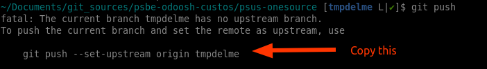

# Git made simple

This page will guide you through the git basics. It will show you **all** the
commands you'll ever need to use git in Odoo (both R&D and PS Tech).

There is multiple ways to achieve the same things in Git, but this guide will
only focus on the simplest and most straightforward way to do things.

This guide will voluntarily explain things in a simple, non-technical way.

## PS Tech repositories

### Basics: clone, create branch, commit & push

1. Clone the repository you want to work on.
    ```bash
    git clone <repository_url>
    ```

2. Create a new branch for your work.
    ```bash
    git checkout -b <branch_name>
    ```

3. Work locally on your branch and commit your changes.
    ```bash
    git add .
    git commit
    ```

4. Push your branch to the remote repository.\
   The simplest here is to push without specifying the remote name and copy
   paste what git suggests.

    
    ```bash
    git push --set-upstream origin <branch_name>
    ```

    > [!TIP]
    > Alternatively, you can directly specify `origin` as the remote name, it
    > will always be the default remote after cloning.

    > [!TIP]
    > `-u` is short for `--set-upstream`, now that's a shortcut!

5. Simply repeat steps 3 and 4 until your work is done. Don't mention the remote
   branch name after the first push.
    ```bash
    git push
    # or if you need to force push
    git push -f
    ```

### Rebasing your dev branch

When working on a development branch, it's important to keep it up to date with the staging or production branch.\
Ideally do it once every few days, or at least before pushing your work for review.

1. Assuming you are already on your development branch, switch to the production
   branch and pull the latest changes.
   ```bash
   git checkout <production_branch>
   # Note that git pull also does a fetch behind the scenes
   git pull
   ```

2. Switch back to your development branch and rebase it onto the updated
   production branch.
   ```bash
    git checkout <development_branch>
    # You can also use `git rebase`
    git pull --rebase origin <production_branch>
    ```

Rebasing a branch basically means:
- Find the common ancestor commit between both branches.
- Temporarily "remove" your commits from the development branch.
- Apply all commits from the production branch since the common ancestor.
- Reapply your commits on top of the updated development branch.

Since both your commit and the production commits might have modified the same lines, you might encounter conflicts during the rebase that you'll need to resolve manually.

### Opening and merging a PR

Once your work is done and pushed to the remote repository, you can open a Pull
Request (PR) to have your changes reviewed and merged into the target branch.

Once the PR is approved, you can merge it using the GitHub interface or via the command line by simply rebasing your branch onto the target branch and pushing the changes.
```bash
git checkout <target_branch>
# Ensure you are up to date
git pull
git pull --rebase origin <branch_name>
git push
```

> [!WARNING]
> Don't use merge commits when merging PRs. Always rebase instead. Even from the
> GitHub interface, select "Rebase and merge".\
> See [Never Use Merge Commit](../../code-playbook/#never-use-merge-commit)

## Push forcing

Sometimes, you might want to push force your branch after rewriting its history,
for instance after a rebase, or when cleaning up your own local commits.

To do so, simply add the `-f` (`--force`) option when pushing your branch.
```bash
git push -f
```

> [!WARNING]
> Unless working with multiple stagings for a single project, you should
> **never** push force a staging branch.\
> Under **no circumstance** should you ever push force a production branch.

## Hard reset

If someone push forced a branch (and so changed its history), your only option
will be to do a hard reset to align your local branch with the remote branch.

```bash
git fetch
git reset --hard
```

Unless working with multiple stagings for a single project (and being the tech
lead), you will never need to use this command.\
If you face another situation where you think you need to use it, ask for help first, someone surely messed up, it will be the opportunity to ensure everyone is on the same page.

## Commit hashes and "ISO PROD"

Every commit in git has a unique identifier called a "hash".\
It's a long string of letters and numbers that looks something like this:
`631f501ba3fc49bcc8465851258fb58235b27444`.

A good way to visualize it is to think of it as a "snapshot" of the repository at a specific point in time, including all the commit history leading up to that point (meaning, all previous commit hashes).

If someone push force a branch, all the hashes of the modified commits will
receive a new hash.

Let's illustrate this with an example. Each commits will receive a hash of 1
digit for simplicity and the history be displayed vertically, from top to
bottom:

**Initial state:**
```
Production Branch:
1
2
3
```

**Create a development branch from production:**
```
Production Branch:
1
2
3

Development Branch:
1
2
3
```
Both branches have the exact same commits, including their hashes.

**Add new commits to the development branch:**
```
Production Branch:
1
2
3

Development Branch:
1
2
3
4
5
```

In the meantime, the production branch received a new commit:
```
Production Branch:
1
2
3
6

Development Branch:
1
2
3
4
5
```

Now, if you rebase your development branch onto the production branch, the commits 4 and 5 will be reapplied on top of commit 6.\
Note that commit 4 and 5 will receive new hashes, as they are now different commits (their parent commit changed), so you'll need to push force your development branch.

```
Production Branch:
1
2
3
6

Development Branch:
1
2
3
6
7 (previously 4)
8 (previously 5)
```

Now, the final step, once your PR is approved, is to rebase the production branch onto the development branch:
```
Production Branch:
1
2
3
6
7
8

Development Branch:
1
2
3
6
7
8
```

You will be able to push normally now, as no commit hashes changed on the production branch, only new commits were added.

The dev branch is called "ISO PROD" when it contains exactly the same commits as
the production branch (it can have more commits on top of it).

In reality, there will be an intermediate branch (staging) between the
development branch and the production branch, but the concept is the same.

### Why is ISO PROD important?

It is important for staging branches and production to keep the same hashes and
history for the commits they share and that production never receive a commit
directly without it being pushed through a staging branch first.

If you don't do that, you will need to push force the staging to align it with
the production branch.\
Doing so, you will change the hashes of the commit, **but** some people may have
already pulled the previous version of the staging branch and eventually created
their own branches from it.

When they will try to rebase their branch onto the new staging branch, they will face conflicts which are:
1. Confusing to simply understand what is it about, especially for new git
   users. People **will** waste time.
2. Fuck up every single open pull request targeting this branch, basically
   adding all commit for which you changed the hash as if those were new
   commit made by that PR owner. A 1-commit-10-LOC PR might be turned into a
   26-commits-1400-LOC PR.
3. Time consuming to resolve, as they will need to `reset --hard` their branch
   and reapply **manually** their commits on top of it.

> [!IMPORTANT]
> Merging commits from staging to production should be done through CLI by
> rebasing branches. Never use any of the Github PR UI option, it will change
> the commit hashes.

## Odoo R&D

There is two main differences when it comes to Odoo R&D repositories:
- https://github.com/odoo/odoo
- https://github.com/odoo/enterprise

The differences are both related to the fact that both repositories are using
their own `dev` remote to push our development branches:
- https://github.com/odoo-dev/odoo
- https://github.com/odoo-dev/enterprise

After cloning the repository (step `1.` above), you'll need to setup the `dev` remote:
```bash
# For Odoo Enterprise, replace `odoo.git` by `enterprise.git`
git config remote.dev.url git@github.com:odoo-dev/odoo.git
git config --add remote.dev.fetch '+refs/heads/*:refs/remotes/dev/*'
```

> [!NOTE]
> Alternatively, check Odoo's official remotes setup guide on the [wiki]

Secondly, when pushing your branch (step `4.` above), you'll need to push to the `dev` remote instead of `origin`:
```bash
git push -u dev <branch_name>
```

## Aliases

You'll type git commands a lot. To save time, you can create aliases for the
most used commands.\
For instance, typing `git co` is much faster than `git checkout`.

Add those lines to your `~/.gitconfig` file:
```bash
[alias]
    co = checkout
    st = status
    br = branch
    cp = cherry-pick
    # For this one, see the "faster pull" section below
    rh = "!f() { git reset --hard @{u}; };f"
```

## Faster pull

When you don't have any local changes, pulling can be made faster by using
`reset --hard`. This will directly set your branch to the remote state, like..
instantly!

Ever got bored waiting for git to pull the 230 new commits on your R&D branch
(e.g `19.0`)? This command will do it instantly.

```bash
git reset --hard @{u}
```

> [!WARNING]
> This can be done on any branch, including development branches, but keep in
> mint that it will discard any local changes you may have, so be careful when
> using it.

## Visual git repository hints

It is absolutely essential to have visual hints about the current git repository
state when working on code.

See my [Visual git repository hints](../shell-tools/git-bash-prompt/README.md)
detailed article.

## Overkill features

To not be overwhelmed by git, those features can be safely ignored as they don't
bring much.

### `--no-ff` for merge commits

Short answer: avoid using merge commits.

> [!TIP]
> See why not using merge commits here: [Never Use Merge Commit](../../code-playbook/#never-use-merge-commit).

### `--force-with-lease` when pushing

This option is used to avoid accidentally overwriting someone else's work when
pushing.\
While it is a good practice in general, it adds complexity without much value in
Odoo.

Simply use `--force` (`-f`).

- Development branch: you can safely assume no one else is working on it. No
  need to be extra careful.
- Production branch: Push forcing should never happen.
- Staging branch: Push forcing should never happen.\
  The only exception is when there are multiple staging branches. When one is
  being pushed on the production branch, other staging branches should be
  force pushed to "rebase" on top of the new production branch.\
  This is a very touchy operation done with care, `--force-with-lease` won't
  be very helpful here.

> [!TIP]
> Staging and production branches should be protected and disable push force at
> all.

### Avoid specifying remote

When pushing, avoid specifying the remote name and branch name every time.\
Instead, simply set it once the first time you push with the `-u`
(`--set-upstream`) command. It will be used every time you push this branch
later.

Don't:
```bash
git push origin my-branch
# .. create new commits..
git push origin my-branch
# .. create new commits..
git push origin my-branch
```
Do:
```bash
git push -u origin my-branch
# .. create new commits..
git push
# .. create new commits..
git push
```

> [!TIP]
> If you are unsure where your branch is pushing to, do `git push -n` (dry run)

[wiki]:  https://github.com/odoo/enterprise/wiki/Git#remotes
