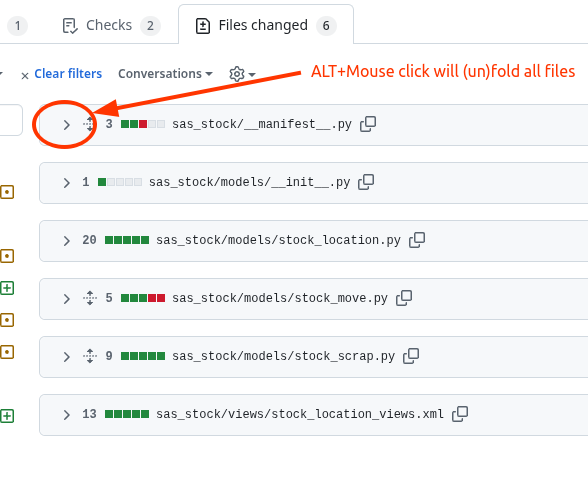
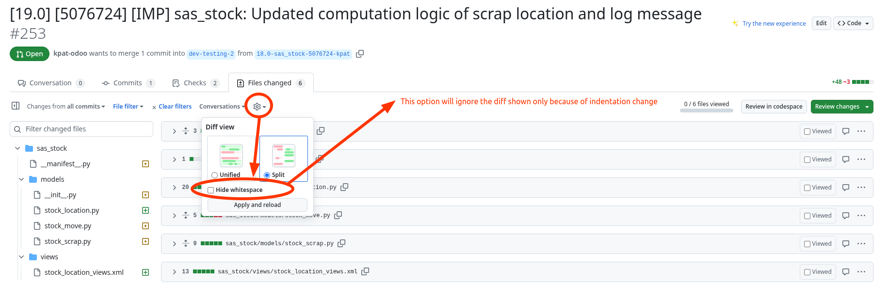

# Github Tricks and Tips

## Fold/Unfold files

When reviewing a pull request or a commit, you can fold or unfold all files at
once by pressing `ALT + Click` on the fold icon of one of the files.

## Canonical URL

When you want to share a file at a specific line, you should never link the
URL as it is. If someone else opens it later, the line number might have changed
and the link will just show other lines.

Instead, you should use the canonical URL feature of Github.

When you are on a specific line, press `?`, then press `y`. This will update the
URL in your browser to a canonical URL that will forever point to the same line,
even if the file change later.

For instance, this URL:\
https://github.com/odoo/odoo/blob/19.0/odoo-bin#L5\
becomes this canonical URL:\
https://github.com/odoo/odoo/blob/f947c1966c9cc9b59dc523cdeff518691e7bf264/odoo-bin#L5

You can also get that URL through the UI:

More details on Github's [permalink documentation].

## Hide whitespace changes

When looking at a diff (commit, PR..), you can hide whitespace changes by adding
`?w=1` at the end of the URL.

This will typically reduce the amount of modified LOC shown when the changes are
mostly indentation changes.\
A 200 LOC diff could be reduced to 20 LOC for instance.

See this example, showing the exact same diff with and without whitespace
changes:
| Without hiding whitespace changes | With hiding whitespace changes |
| --------------------------------- | ------------------------------ |
|   |  |

You can also enable that option through the UI:

## Open file in virtual IDE

When browsing a file on Github, you can open it in the virtual IDE of
Github (similar to VSCode) by pressing `.` (dot).

You can also just replace `github.com` with `github.dev` in the URL.

_-- Courtesy of SUJU_

## `.patch` URL trick
When you are looking at a commit or a pull request on Github, you can get the
corresponding patch file by adding `.patch` at the end of the URL.

You can then download that file and apply it locally with `git am` for instance.

That's also a convenient and reliable way to find someone's exact Github email
address and name if you need to to `git commit --author="Name <email>"` to
match their identity on Github.\
It's also useful to add co-authors with the
`Co-authored-by: Name <email>` trailer.

[permalink documentation]: https://docs.github.com/en/repositories/working-with-files/using-files/getting-permanent-links-to-files
