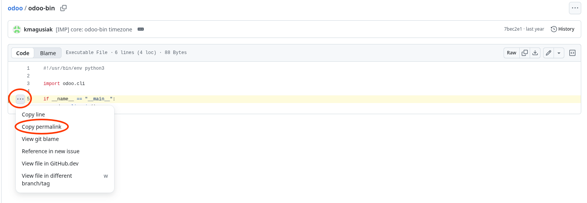
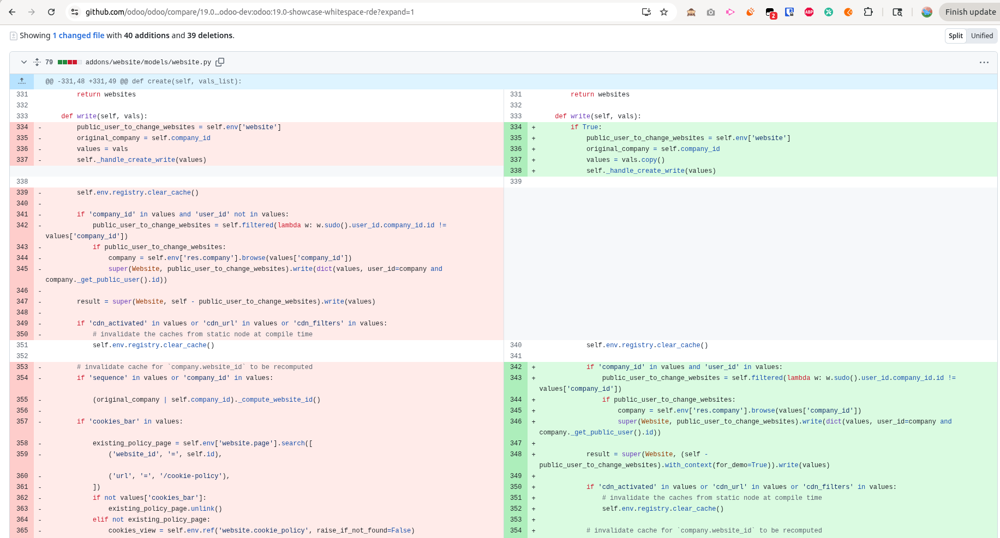
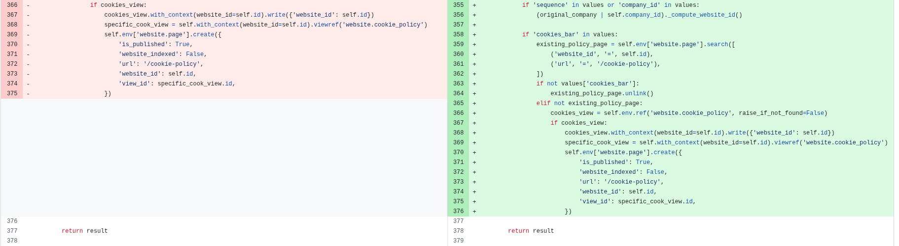
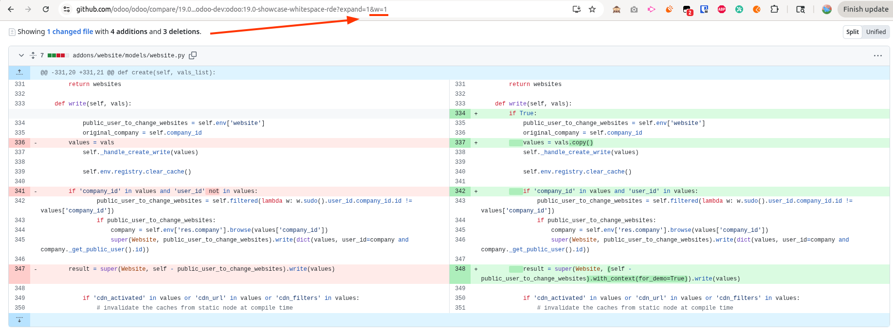

# Github Tricks and Tips

## Fold/Unfold files

When reviewing a pull request or a commit, you can fold or unfold all files at
once by pressing `ALT + Click` on the fold icon of one of the files.

## Canonical URL

When you want to share a file at a specific line, you should never link the
link as is, because if someone else open it later, the line number might have
changed and the link will just show other lines.

Instead, you should use the canonical URL feature of Github.

When you are on a specific line, press `CTRL + ?` (or `CMD + ?` on Mac), then
press `Y`. This will update the URL in your browser to a canonical URL that will
always point to the same line, even if the file change later.

For instance, this URL:
https://github.com/odoo/odoo/blob/19.0/odoo-bin#L5
becomes this canonical URL:
https://github.com/odoo/odoo/blob/f947c1966c9cc9b59dc523cdeff518691e7bf264/odoo-bin#L5

You can also get that URL through the UI:

More details on Github documentation:\
https://docs.github.com/en/repositories/working-with-files/using-files/getting-permanent-links-to-files

## Hide whitespace changes

When looking at a diff (commit, PR..), you can hide whitespace changes by adding
`?w=1` at the end of the URL.\

This will typically reduce the amount of changes shown when there are
indentation changes only.\
A 200 LOC diff could be reduced to 20 LOC for instance.

See this example, showing the exact same diff with and without whitespace
changes:
- Without hiding whitespace changes:
  
  

- With hiding whitespace changes:
  

## .patch trick
TODO

## Check user name and email
TODO
You can apply .patch