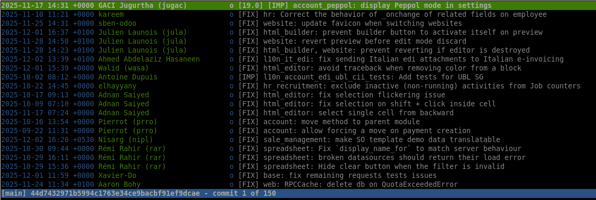
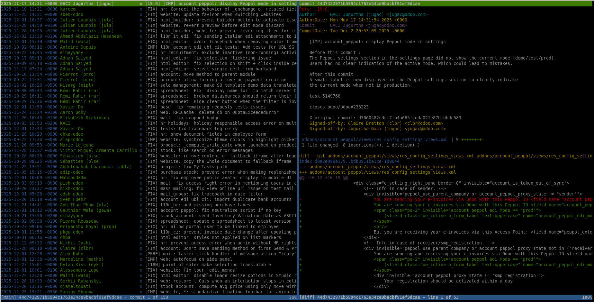

# `tig`

`tig` is a text-mode interface for git. It allows you to browse the history of
a repository in a very convenient way.

Don't use `git log`, it is verbose, hard to read, and not interactive.\
Even using `git shortlog`, `git log --oneline` or other variations is not as
good as using `tig`.

This is how it looks like:

You can navigate through commits up/down using arrow keys (one commit at a time)
or `PgUp`/`PgDn` (one page at a time).

Press `Enter` on a commit to see its details and diff.

Press `q` to go back to the commit list view.

When the commit details view is opened, you can press `Enter` to scroll down the
diff. `PgUp`/`PgDn` can also be used to scroll faster here.

From the commit view, you can press `SHIFT+o` to open the commit full screen.\
Simply press `q` to go back to the previous view.

> [!NOTE]
> This tool can do a lot more than this, like browsing through a LOC history to
> find when it was introduced for instance.